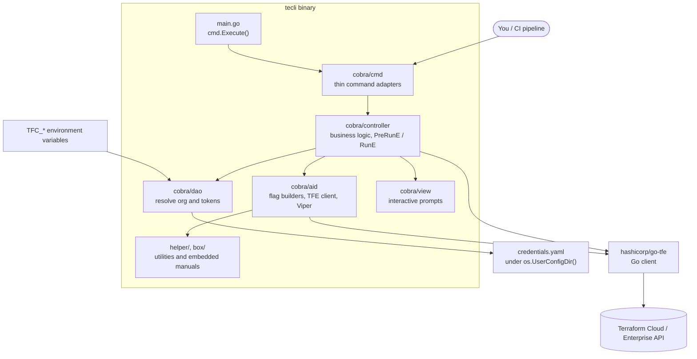
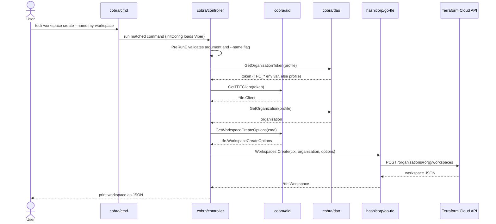

# Architecture

This page describes how TECLI is structured, how a command flows from your terminal to the Terraform Cloud API, and the design decisions behind the layout. Read it before you make your first change. Package-level detail lives in the Go doc comments and the [wiki](https://github.com/awslabs/tecli/wiki).

## Overview

TECLI is a thin command-line wrapper around [`hashicorp/go-tfe`](https://github.com/hashicorp/go-tfe), the official Go client for the Terraform Cloud (TFC) and Terraform Enterprise (TFE) API. The binary is produced by [`main.go`](main.go), which calls `cmd.Execute()` from the `cobra/cmd` package.

The command framework is [Cobra](https://github.com/spf13/cobra). Configuration and environment-variable binding use [Viper](https://github.com/spf13/viper).

## Components

The dependency direction flows in one direction, from the command adapters down to the API client:

Layers below `controller` do not import `cmd`. Layers below `aid` do not import `controller`.

| Path                 | Role                                                                                                                                                                                                                                                                                                           |
| -------------------- | -------------------------------------------------------------------------------------------------------------------------------------------------------------------------------------------------------------------------------------------------------------------------------------------------------------- |
| `main.go`            | Process entry point. Calls `cmd.Execute()`.                                                                                                                                                                                                                                                                    |
| `cobra/cmd/`         | Thin adapters. One file per top-level command (`workspace`, `run`, `apply`, `plan`, `configuration-version`, `configure`, `o-auth-client`, `o-auth-token`, `ssh-key`, `variable`, `version`). Each file pulls a `*cobra.Command` from the controller package and registers it on `rootCmd`. No business logic. |
| `cobra/controller/`  | Business logic. Builds each `cobra.Command` with `Use`, `Short`, `Long`, and `Example` filled from `box/resources/manual/*.yaml`, wires `PreRunE` and `RunE`, validates flags through `helper.ValidateCmdArg*`, and calls `go-tfe`.                                                                            |
| `cobra/aid/`         | Option builders and file I/O. `SetXxxFlags(cmd)` registers per-command flags. Helpers marshal flag values into `tfe.XxxOptions{}`, read and write the credentials file, and load Viper config.                                                                                                                 |
| `cobra/dao/`         | Data-access functions that read the organization and tokens from the active profile or environment variables (`configure.go`).                                                                                                                                                                                 |
| `cobra/model/`       | Plain structs, including `CredentialProfile` used by the `configure` command.                                                                                                                                                                                                                                  |
| `cobra/view/`        | Output rendering helpers, including the interactive `configure` prompts.                                                                                                                                                                                                                                       |
| `helper/`            | General utilities: argument and flag validation (`cobra.go`), directory and file helpers, `manual.go` (`GetManual` reads the YAML manuals out of `box`), SSH helpers, and string helpers. No Terraform Cloud domain knowledge.                                                                                 |
| `box/`               | Embedded resources. `box.go` exposes the embedded blob and `gen.go` regenerates it. `resources/manual/*.yaml` defines each command's `Use`, `Short`, `Long`, and `Example`. `resources/VERSION` holds the version string that `tecli version` prints.                                                          |
| `clencli/`           | Templates and assets used to render the README and screenshots: `readme.tmpl`, `readme.yaml`, `terminalizer/*.gif`, and `logo.jpeg`.                                                                                                                                                                           |
| `habits/`            | Submodule hosting shared Make targets included from `Makefile` (for example, `go/build`, `go/fmt`, `go/install`).                                                                                                                                                                                              |
| `examples/`          | End-user usage examples, such as `examples/gitlab/` for GitLab CI.                                                                                                                                                                                                                                             |
| `tests/`             | Integration tests that call Terraform Cloud. They require `TFC_*` environment variables or a configured profile. `tests/commands/` holds the per-command test files.                                                                                                                                           |
| `.github/workflows/` | CI: `build.yml` (per-push build), `publish.yml` (tag-driven release), `release.yml` (release-please).                                                                                                                                                                                                          |

## Data flow

A single command, such as `tecli workspace list`, flows through the layers:

1. `main.go` calls `cmd.Execute()`, which runs the Cobra command tree.
2. `initConfig` calls `aid.LoadViper()`, which binds the `TFC_*` environment variables and reads the credentials file if one exists.
3. The matched controller runs `PreRunE` to validate the argument and its required flags.
4. `RunE` reads the resolved token through `cobra/dao` (environment variable first, then the active profile), builds a `*tfe.Client` with `aid.GetTFEClient`, and calls the matching `go-tfe` method.
5. The controller prints the API response as JSON.

The following sequence shows `tecli workspace create --name my-workspace`:

## Design decisions

- **Thin wrapper over `go-tfe`.** TECLI does not reimplement Terraform Cloud logic. Each command maps to one `go-tfe` call, so the output mirrors the API response. Upgrading `go-tfe` is the main way new API behavior reaches the CLI.
- **Credentials resolved at call time.** The organization and tokens are read from Viper when a command runs, not bound to global flags. Environment variables (`TFC_*`) override the active profile. The organization is never passed as a command-line flag.
- **Manuals live in YAML, not in code.** Each command's help text comes from `box/resources/manual/<name>.yaml`. Help text changes do not require touching Go source.
- **One-directional layering.** The `cmd` -> `controller` -> `aid` -> `helper`/`box` dependency direction keeps adapters free of business logic and keeps utilities free of Terraform Cloud knowledge.

## Adding a command

1. Add a YAML manual at `box/resources/manual/<name>.yaml` describing `use`, `short`, `long`, and `example`.
2. Add `cobra/controller/<name>.go` that:
   - Declares `var <name>ValidArgs = []string{ ... }`.
   - Builds a `*cobra.Command` from `helper.GetManual("<name>", validArgs)`.
   - Implements `<name>PreRun` for flag validation and `<name>Run` to call `go-tfe`.
3. Add `cobra/aid/<name>.go` with `SetXxxFlags(cmd *cobra.Command)` and the option-builder helpers.
4. Register the command in `cobra/cmd/<name>.go` and add the `rootCmd.AddCommand(<name>Cmd)` call.
5. Run `go build ./...` and `go vet ./...`. Add tests under `tests/commands/` if the command needs them.
6. Document the command in [COMMANDS.md](COMMANDS.md) and, if it is a common task, in [TOP-COMMANDS.md](TOP-COMMANDS.md).

## Configuration and credentials

`tecli configure create` writes a YAML credentials file named `credentials.yaml` under the user configuration directory (for example, `~/Library/Application Support/tecli/credentials.yaml` on macOS or `~/.config/tecli/credentials.yaml` on Linux). Each profile holds `organization`, `user-token`, `team-token`, and `organization-token`. The same values can come from the `TFC_ORGANIZATION`, `TFC_USER_TOKEN`, `TFC_TEAM_TOKEN`, and `TFC_ORGANIZATION_TOKEN` environment variables, which take precedence.

Most commands accept `--profile`/`-p` (default `default`), so one host can target multiple Terraform Cloud organizations.

## Build and release

- Local build: `go build ./...`. Requires Go 1.25 or later.
- Cross-compile: `make tecli/compile` writes binaries to `dist/`.
- Release: see [docs/RELEASING.md](docs/RELEASING.md).
