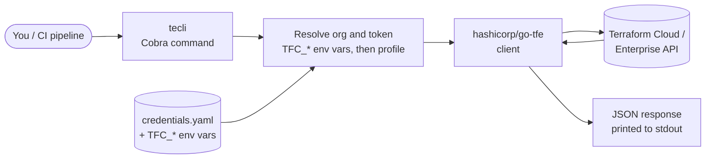

# TECLI

A command-line interface for the Terraform Cloud and Terraform Enterprise API.

[](https://github.com/awslabs/tecli/issues)
[](https://github.com/awslabs/tecli/network)
[](https://github.com/awslabs/tecli/stargazers)
[](https://github.com/awslabs/tecli/blob/main/LICENSE)

## Overview

TECLI (Terraform Enterprise/Cloud Command Line Interface) wraps the [Terraform Cloud API](https://www.terraform.io/docs/cloud/api/index.html) so you can manage Terraform Cloud (TFC) and Terraform Enterprise (TFE) resources from a terminal or a CI/CD pipeline. It is built on the official [`hashicorp/go-tfe`](https://github.com/hashicorp/go-tfe) Go client.

You use TECLI to manage workspaces, runs, plans, applies, variables, configuration versions, SSH keys, and VCS (OAuth) connections without leaving the command line. Each command maps to a Terraform Cloud API resource, so the output is the JSON the API returns.

This tool is for platform engineers and infrastructure teams who automate Terraform Cloud or Terraform Enterprise operations.

## Features

- Manage workspaces: list, create, read, update, delete, lock, unlock, and connect to a VCS repository.
- Manage runs: create, read, apply, cancel, force-cancel, and discard.
- Read plan and apply logs.
- Manage Terraform and environment variables on a workspace.
- Upload configuration versions for a run.
- Manage SSH keys for private module access.
- Manage OAuth clients and tokens for VCS provider integrations.
- Select between multiple Terraform Cloud organizations using named profiles.

## Prerequisites

- A Terraform Cloud or Terraform Enterprise account.
- An API token. The token you need depends on the operation: a [user, team, or organization token](https://www.terraform.io/docs/cloud/users-teams-organizations/api-tokens.html). Most workspace and run operations use a team token.
- Go 1.25 or later, only if you build from source.

## Installation

### Install a pre-built binary

1. Download the latest [release](https://github.com/awslabs/tecli/releases) for your operating system and architecture.
2. Extract the binary to a directory on your `PATH`.
3. Verify the installation:

```bash
tecli version
```

### Build from source

```bash
git clone https://github.com/awslabs/tecli.git
cd tecli
go build -o tecli .
./tecli version
```

Building from source requires Go 1.25 or later. The Terraform Cloud client is [`hashicorp/go-tfe`](https://pkg.go.dev/github.com/hashicorp/go-tfe) v1.108.0.

## Getting started

1. Create a profile. The interactive prompt asks for your organization and tokens:

```bash
tecli configure create
```

2. List the workspaces in your organization to confirm the credentials work:

```bash
tecli workspace list
```

TECLI reads the organization and tokens from the active profile or from environment variables. You do not pass the organization on the command line. See [Configuration](#configuration).

## Usage

A command follows this structure:

```bash
tecli <command> <argument> [flags]
```

`<command>` is a resource such as `workspace` or `run`. `<argument>` is the operation such as `list` or `create`. The persistent `--profile` flag selects which credentials profile to use.

List all workspaces in the organization on the active profile:

```bash
tecli workspace list
```

Find a workspace by name:

```bash
tecli workspace find-by-name --name your-workspace-name
```

Create a workspace:

```bash
tecli workspace create --name your-workspace-name --allow-destroy-plan=true
```

Create a workspace connected to a VCS repository:

```bash
# List OAuth tokens to find the token ID
tecli o-auth-token list

# Create the workspace with the VCS connection
tecli workspace create \
  --name your-workspace-name \
  --vcs-repo-oauth-token-id ot-XXXXXXXX \
  --vcs-repo-identifier org/repo
```

Create and apply a run:

```bash
# Create a configuration version on the workspace
tecli configuration-version create --workspace-id ws-XXXXXXXX

# Upload the configuration files to the returned upload URL
tecli configuration-version upload --url https://archivist.terraform.io/... --path ./

# Create a run
tecli run create --workspace-id ws-XXXXXXXX --message "Initial run"

# Read the run status
tecli run read --id run-XXXXXXXX

# Apply the run
tecli run apply --id run-XXXXXXXX --comment "Applying changes"
```

For the full command reference, see [COMMANDS.md](COMMANDS.md). For copy-paste recipes covering the most common tasks, see [TOP-COMMANDS.md](TOP-COMMANDS.md).

## Configuration

TECLI reads the organization and API tokens in this precedence order:

1. `TFC_*` environment variables.
2. The active profile in the credentials file.

### Credentials file

`tecli configure create` writes a YAML credentials file named `credentials.yaml` under the user configuration directory:

- macOS: `~/Library/Application Support/tecli/credentials.yaml`
- Linux: `~/.config/tecli/credentials.yaml` (or `$XDG_CONFIG_HOME/tecli/credentials.yaml`)
- Windows: `%AppData%\tecli\credentials.yaml`

Each profile holds an `organization`, `user-token`, `team-token`, and `organization-token`. You select a profile with the persistent `--profile`/`-p` flag (default `default`), so one host can target multiple organizations.

### Environment variables

Set the following environment variables to override the profile values. Environment variables take precedence over the credentials file.

```bash
# Linux and macOS
export TFC_ORGANIZATION=your-organization
export TFC_USER_TOKEN=your-user-token
export TFC_TEAM_TOKEN=your-team-token
export TFC_ORGANIZATION_TOKEN=your-organization-token
```

```powershell
# Windows (PowerShell)
$Env:TFC_ORGANIZATION = "your-organization"
$Env:TFC_USER_TOKEN = "your-user-token"
$Env:TFC_TEAM_TOKEN = "your-team-token"
$Env:TFC_ORGANIZATION_TOKEN = "your-organization-token"
```

The `configure` command reads and writes the credentials file only. It does not use environment variables.

## Architecture

TECLI is a thin command-line wrapper around `hashicorp/go-tfe`. The `main` package calls `cmd.Execute()`, which builds a Cobra command tree. Each command validates flags, marshals them into `go-tfe` option structs, calls the Terraform Cloud API, and prints the JSON response.


```mermaid
%% High-level request flow
flowchart LR
    user([You / CI pipeline]) --> cli["tecli<br/>Cobra command"]
    cli --> resolve["Resolve org and token<br/>TFC_* env vars, then profile"]
    config[("credentials.yaml<br/>+ TFC_* env vars")] --> resolve
    resolve --> gotfe["hashicorp/go-tfe<br/>client"]
    gotfe --> tfc[("Terraform Cloud /<br/>Enterprise API")]
    tfc --> gotfe
    gotfe --> out["JSON response<br/>printed to stdout"]
```

For components, data flow, and design decisions, see [ARCHITECTURE.md](ARCHITECTURE.md).

## Troubleshooting

- **`workspace list` returns no workspaces or an authentication error.** Confirm the active profile has an organization and the matching token set, or that the `TFC_*` environment variables are exported in the current shell. Run `tecli configure read` to inspect the active profile.
- **A command reports it cannot find a workspace by ID.** Commands that take `--id` or `--workspace-id` expect a Terraform Cloud resource ID (for example, `ws-XXXXXXXX`), not a name. Use `--name` with the name-based subcommands such as `workspace find-by-name`.
- **The wrong organization is used.** The `TFC_ORGANIZATION` environment variable overrides the profile. Unset it to fall back to the profile value.

## Contributing

See [Contributing](CONTRIBUTING.md).

## Security

See [Security](SECURITY.md) for vulnerability reporting.

## License

This project is licensed under the Apache License 2.0. See [LICENSE](LICENSE).

---

```text
Copyright Amazon.com, Inc. or its affiliates. All Rights Reserved.
```
