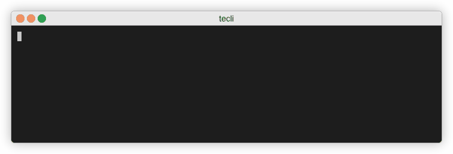
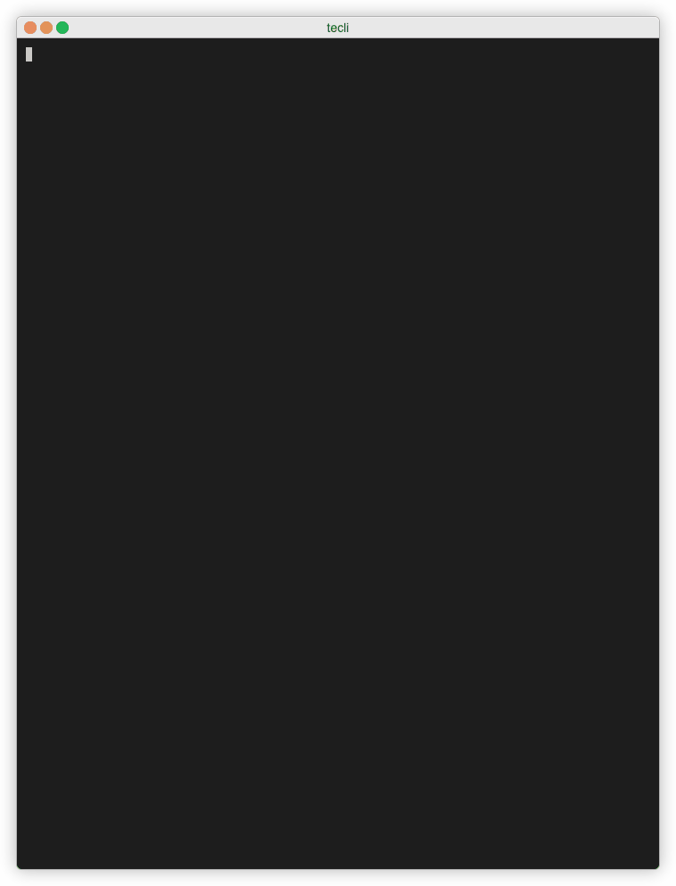
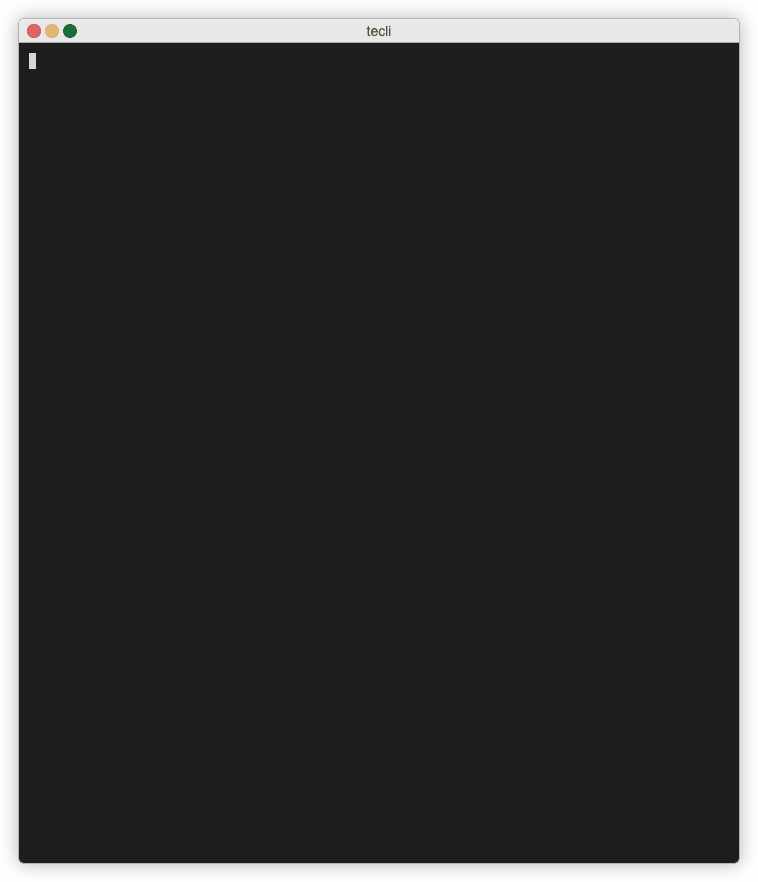
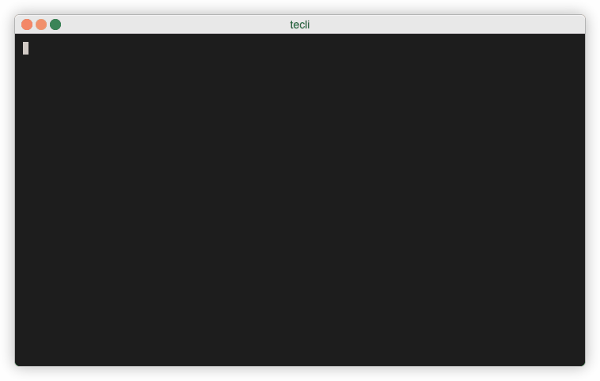
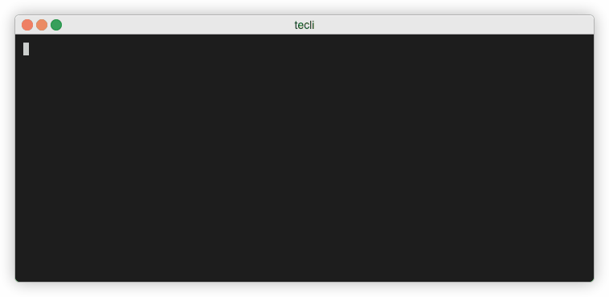
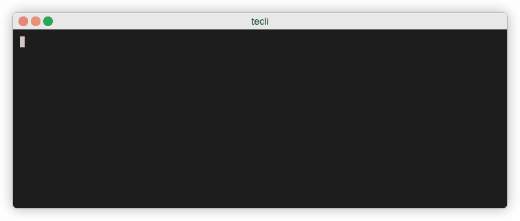
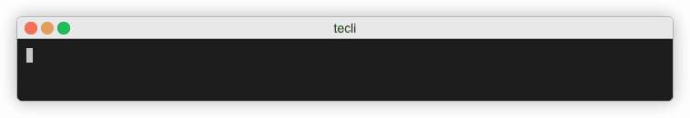

# TECLI - Terraform Enterprise/Cloud Command Line Interface

<div align="center">


[](https://github.com/awslabs/tecli/issues)
[](https://github.com/awslabs/tecli/network)
[](https://github.com/awslabs/tecli/stargazers)
[](https://github.com/awslabs/tecli/blob/master/LICENSE)
[](https://twitter.com/intent/tweet?text=Wow:&url=https%3A%2F%2Fgithub.com%2Fawslabs%2Ftecli)

</div>

## 📖 Overview

TECLI is a powerful command-line interface designed to interact with [Terraform Cloud API](https://www.terraform.io/docs/cloud/api/index.html). It enhances team productivity by providing intuitive commands that can be executed in a terminal or integrated into CI/CD pipelines.

In a world where infrastructure as code is becoming the standard, TECLI bridges the gap between your workflows and Terraform Cloud, making it easier to manage workspaces, runs, variables, and more.

## 🚀 Features

- **Workspace Management**: Create, read, update, delete, and list Terraform workspaces
- **Run Operations**: Create, apply, and discard Terraform runs
- **Plan & Apply Management**: View logs for plan and apply operations
- **Variable Management**: Create, update, and delete Terraform and environment variables
- **VCS Integration**: Connect workspaces to version control repositories
- **SSH Key Management**: Manage SSH keys for private module access
- **OAuth Client Management**: Configure OAuth clients for VCS providers

## 📋 Table of Contents

- [Installation](#-installation)
- [Configuration](#-configuration)
- [Usage Examples](#-usage-examples)
- [Command Reference](#-command-reference)
- [Common Workflows](#-common-workflows)
- [Screenshots](#-screenshots)
- [Contributing](#-contributing)
- [References](#-references)
- [License](#-license)

## 📥 Installation

### Prerequisites

Before installing TECLI, ensure you have:

- A Terraform Cloud/Enterprise account
- Appropriate API tokens (user, team, or organization)

For more detailed prerequisites, visit our [Pre-Requisites Wiki](https://github.com/awslabs/tecli/wiki/Pre-Requisites).

### Installation Steps

1. Download the latest [release](https://github.com/awslabs/tecli/releases) for your operating system and platform.
2. Extract the binary to a location in your PATH.
3. Verify the installation:

```bash
tecli version
```

For more detailed installation instructions, visit our [Installation Wiki](https://github.com/awslabs/tecli/wiki/Installation).

## ⚙️ Configuration

TECLI requires configuration before use. You can configure it in two ways:

### Using the Configure Command

```bash
tecli configure create
```

This interactive command will guide you through setting up your profile with:
- Organization name
- User token
- Team token
- Organization token

### Using Environment Variables

```bash
# Linux/macOS
export TFC_ORGANIZATION=your-organization
export TFC_USER_TOKEN=your-user-token
export TFC_TEAM_TOKEN=your-team-token
export TFC_ORGANIZATION_TOKEN=your-organization-token

# Windows (PowerShell)
$Env:TFC_ORGANIZATION="your-organization"
$Env:TFC_USER_TOKEN="your-user-token"
$Env:TFC_TEAM_TOKEN="your-team-token"
$Env:TFC_ORGANIZATION_TOKEN="your-organization-token"
```

## 🔍 Usage Examples

### Basic Command Structure

```bash
tecli <resource> <action> [flags]
```

### List All Workspaces

```bash
tecli workspace list --organization=your-organization
```

### Find a Workspace by Name

```bash
tecli workspace find-by-name --organization=your-organization --name=your-workspace-name
```

### Create a Workspace

```bash
tecli workspace create --organization=your-organization --name=your-workspace-name --allow-destroy-plan=true
```

### Create a Workspace with VCS Repository

```bash
# First, get the OAuth Token ID
tecli o-auth-token list --organization=your-organization

# Then create the workspace with VCS connection
tecli workspace create \
  --organization=your-organization \
  --name=your-workspace-name \
  --vcs-repo-oauth-token-id=your-oauth-token-id \
  --vcs-repo-identifier=org/repo
```

### Create and Apply a Run

```bash
# Create a configuration version
tecli configuration-version create --workspace-id=your-workspace-id

# Upload configuration files
tecli configuration-version upload --url=your-upload-url --path=./

# Create a run
tecli run create --workspace-id=your-workspace-id --comment="Your comment"

# Check run status
tecli run read --id=your-run-id

# Apply the run
tecli run apply --id=your-run-id --comment="Apply comment"
```

### Manage Variables

```bash
# Create a sensitive Terraform variable
tecli variable create \
  --key=your-variable-key \
  --value=your-variable-value \
  --workspace-id=your-workspace-id \
  --category=terraform \
  --sensitive=true

# Create AWS environment variables
tecli variable create --key=AWS_ACCESS_KEY_ID --value=your-access-key --workspace-id=your-workspace-id --category=env --sensitive=true
tecli variable create --key=AWS_SECRET_ACCESS_KEY --value=your-secret-key --workspace-id=your-workspace-id --category=env --sensitive=true
tecli variable create --key=AWS_DEFAULT_REGION --value=your-region --workspace-id=your-workspace-id --category=env --sensitive=true
```

## 📚 Command Reference

TECLI provides the following main commands:

```
Available Commands:
  apply                 An apply represents the results of applying a Terraform Run's execution plan.
  configuration-version A configuration version is a resource used to reference the uploaded configuration files.
  configure             Configures tecli settings
  help                  Help about any command
  o-auth-client         An OAuth Client represents the connection between an organization and a VCS provider.
  o-auth-token          The oauth-token object represents a VCS configuration which includes the OAuth connection and the associated OAuth token.
  plan                  A plan represents the execution plan of a Run in a Terraform workspace.
  run                   A run performs a plan and apply, using a configuration version and the workspace's current variables.
  ssh-key               The ssh-key object represents an SSH key which includes a name and the SSH private key.
  variable              Operations on variables.
  version               Displays the version of tecli and all installed plugins
  workspace             Workspaces represent running infrastructure managed by Terraform.
```

For detailed information about a specific command:

```bash
tecli [command] --help
```

## 🔄 Common Workflows

### Complete Terraform Run Workflow

```bash
# Create a workspace
tecli workspace create --organization=your-org --name=your-workspace

# Create a configuration version
tecli configuration-version create --workspace-id=your-workspace-id

# Upload configuration files
tecli configuration-version upload --url=your-upload-url --path=./

# Create a run
tecli run create --workspace-id=your-workspace-id --comment="Initial run"

# Monitor run status
tecli run read --id=your-run-id

# View plan logs
tecli plan logs --id=your-plan-id

# Apply the run
tecli run apply --id=your-run-id --comment="Applying changes"

# View apply logs
tecli apply logs --id=your-apply-id
```

### Monitoring and Waiting for Run Completion

```bash
# Bash script to wait for run completion
while true; do 
  STATUS=$(tecli run read --id=your-run-id | jq -r ".Status")
  if [ "${STATUS}" != "pending" ]; then 
    break
  else 
    echo "RUN STATUS:${STATUS}, IF 'pending' TRY DISCARD PREVIOUS PLANS. SLEEP 5 seconds" && sleep 5
  fi
done
```

## 📸 Screenshots

<details>
<summary>Click to expand screenshots</summary>

|  |
| :-----------------------------------------------------: |
|                   _How to configure_                    |

|  |
| :---------------------------------------------------------------------: |
|                       _How to create a workspace_                       |

|  |
| :---------------------------------------------------------------------------------------------------: |
|                          _How to create a workspace linked to a repository_                           |

|  |
| :---------------------------------------------------------: |
|                    _How to create a run_                    |

|  |
| :----------------------------------------------------------: |
|                   _How to read plan logs_                    |

|  |
| :------------------------------------------------------------: |
|                    _How to read apply logs_                    |

|  |
| :---------------------------------------------------------------------: |
|                       _How to delete a workspace_                       |

</details>

## 👥 Contributing

We welcome contributions to TECLI! Please read our [Contributing Guidelines](CONTRIBUTING.md) for details on how to submit pull requests, report issues, and suggest improvements.

### Contributors

| Name | Email | Role |
| :--: | :---: | :--: |
| Silva, Valter | valterh@amazon.com | AWS Professional Services - Cloud Architect |
| Dhingra, Prashit | | AWS Professional Services - Cloud Architect |

## 🔗 References

- [Terraform Cloud](https://www.terraform.io/docs/cloud/index.html) - Terraform Cloud is an application that helps teams use Terraform together.
- [Terraform Cloud/Enterprise Go Client](https://github.com/hashicorp/go-tfe) - The official Go API client for Terraform Cloud/Enterprise.
- [clencli](https://github.com/awslabs/clencli) - Cloud Engineer CLI
- [terminalizer](https://github.com/faressoft/terminalizer) - Record your terminal and generate animated gif images or share a web player link terminalizer.com

## 📄 License

This project is licensed under the Apache License 2.0. For more information, please read [LICENSE](LICENSE).

---

```
Copyright Amazon.com, Inc. or its affiliates. All Rights Reserved.
```

> Photo by [Gabriel Menchaca](https://unsplash.com/gabrielmenchaca) on [Unsplash](https://unsplash.com)
